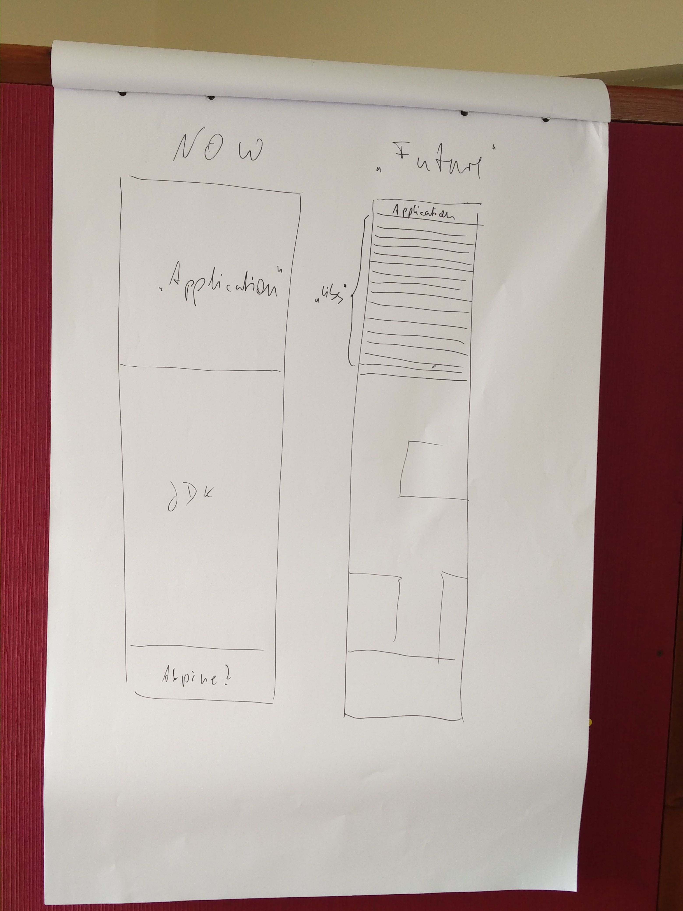

# Java-Docker-Alignment
Convened by [Gerd Aschemann](https://twitter.com/GerdAschemann).

## Summary

Discussion items:
* Starting point: [Spring Boot Thin Launcher](https://github.com/dsyer/spring-boot-thin-launcher) 
  * provides very thin application loader (loads all dependencies via Maven at runtime)
  * already has Docker mode (run with dryrun option to prefill Maven cache)
  * has space for optimizations, e.g., drop test dependencies
* Possible improvement for Docker: 
  * Add dependencies as Docker layers and only replace top most layer, i.e., _the application_ (jar)
  * Will enable faster shipment of final image updates, once the base layers are downloaded
  * Changes in dependencies currently would lead to updates of some _layers_ (the dependency tree was mapped to a sequence, this could be somehow improved in future Docker versions?)
* Similar approach is already possible with Maven Docker plugins (make a libraries layer)
* Could also improve Java EE Micro Profile in Docker
* Then Spring Boot and Micro Profile lower layers (beyond the application) in Docker would effectively become some sort of
  _Application Server_ (this lead to some nice discussions about terminology)

## Resources
