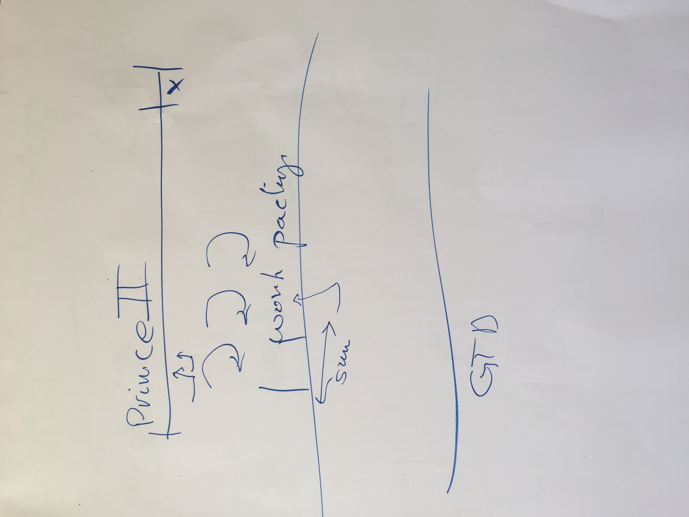

Developing with Purpose
=========================
Convener: [Kon Soulianidis](http://outrospective.org)
A session conducted along with [Human Interaction Protocol](../HumanInteractionProtocol/README.md) with Kees

How many people find their development methodology (Kanban, Agile, Scrum, some kind of 'lean', CHAOS!) actually works for them?  Many also note that when interfacing with the business, the management usually plan and act in a waterfall way. 
This usually leads to processes that get in the way of delivering real business value and reduce your flow.

## Are you building the right thing?
[Vanguard Method](http://vanguard-method.net) is an organisational wide process that focusses on service businesses.  It focusses on shared measures (KPIs) across all teams, including IT.  This means that if the core business doesnt succeed than the supporting departments, _ie the developers_, wont succeed either.
Vanguard introduces two concepts
- __Value Demand__: A request from a client which is what the business is meant to do.  _Eg I contact my bank with a request to deposit money_
- __Failure Demand__: A request from a client following up about a previous request. Due to something we told the client would happen, but hasn't happened yet.  _Eg Why hasn't my deposit appeared in my statement?_

## Developing with Purpose
The convener talked about the use of a Vanguard based development methodology where the team backlog was driven by tracking Value and Failure demand, and using hard statistics to track what was needed to be worked on next.  We would walk directly with the users to build out features, and when the features has been iterated on, first with a single user, then a team, and considered 'about right', would be released to the enitre country.  The process leads to a very lean way of delivering with purpose

Links
-------
 - [John Seddon](https://en.wikipedia.org/wiki/John_Seddon)
 - [Freedom from Command and Control - John Seddon](https://www.amazon.com.au/Freedom-Command-Control-Rethinking-Management-Lean-Service/dp/B006IED6CQ)
