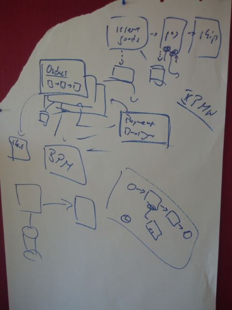
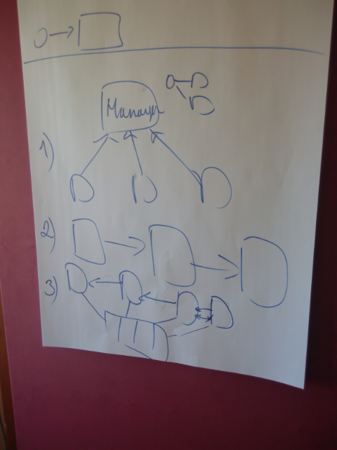

# Complex flows in distributed systems
Convenor: [Bernd](http://bernd-ruecker.com/)

The *Saga pattern* describes how to solve distributed (business) transactions without two-phase-commit. The basic idea is to break the overall transaction into multiple steps or activities. Only the steps internally can be performed in atomic transactions but the overall consistency is taken care of by the Saga. The Saga has the responsibility to either get the overall business transaction completed or to leave the system in a known termination state. So in case of errors a business rollback procedure is applied which occurs by calling compensation steps or activities in reverse order. 

Implementation can be a *[Process Manager](http://www.enterpriseintegrationpatterns.com/patterns/messaging/ProcessManager.html)*

Process Manager does not necessarily mean you have a "central" BPM engine, but can be embedded in each microservice.

Microservices might communicate via event bus (Kafka, Rabbit, ...). This case typically the consumer is coupled (I know I have to listen to event X) and not the sender (I know I have to call X now). It is typically more flexible to add new consumers then. Compensation chains might be tricky to implement without coupling in two ways.

Direct communication between the services means you couple it tightly and you have to reverse from the next to previous. 

BPM could help with it to orchestrate.

Example of "ebay-like" service:
* Send avro messages which have a Schema 
* Kafka underneath
* No orchestration, but "it is a mess"
* Hermes keeps track until which point the messages have been consumed and pushes them to the service
* Have another service listening to all the events to have a state

# Links

* [Saga exmple using lightweight workflow engine](https://github.com/flowing/flowing-trip-booking-saga)
* [Saga: How to implement complex business transactions without two phase commit.](https://blog.bernd-ruecker.com/saga-how-to-implement-complex-business-transactions-without-two-phase-commit-e00aa41a1b1b)
* [Why service collaboration needs choreography AND orchestration](https://blog.bernd-ruecker.com/why-service-collaboration-needs-choreography-and-orchestration-239c4f9700fa)